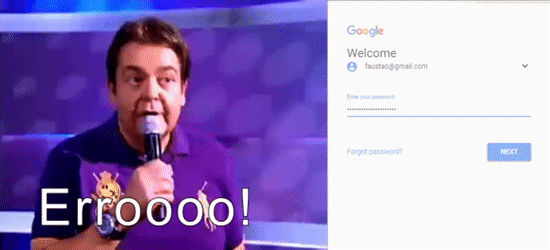

# Faustão Authenticator

Play the renowned Faustão sound for failed passwords.

## Install

This is a chrome extension, follow these steps to install it:

1. Download the [Faustão Authenticator](https://github.com/luanorlandi/faustao-authenticator/archive/master.zip) extension
2. Go to the [extensions page](chrome://extensions/) of Google Chrome
3. Enable [Developer mode](https://developer.chrome.com/extensions/faq#faq-dev-01)
4. Click on "Load unpacked extension..." to browse the downloaded extension and install it

Now go to [Google Accounts](https://accounts.google.com) and try to login with a wrong password.

## Contributing

Faustão Authenticator needs more logins to be check it.

If you would like to contribute, please check [CONTRIBUTING.md](CONTRIBUTING.md).

## License

MIT